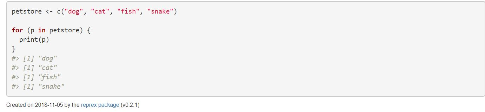
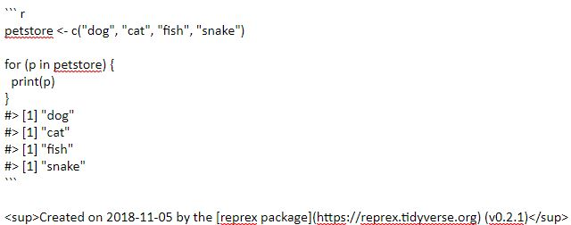

# Troubleshooting
So you're stuck with trying to fix your code and you want to e-mail it to your TA or friend. What is a good way to do it? I can tell you 
that copy+paste is a no-no. 

So what to do? Well luckily, there's an R Package for that. It's called [reprex](https://reprex.tidyverse.org/index.html).
Reprex stands for reproducible example. When you use Copy+Paste to send a code, I might not be able to run it on my machine.
You can use this package to create a reproducible example! So how does that work? 


### 1. Install and add the reprex package to your library.
``` r
install.packages("reprex")
library(reprex)
```
You can also install the developer's version if you are having issues with the other install.

```r
devtools::install_github("tidyverse/reprex")
library(reprex)
```

### 2. Let's just say you're having hypothetical issues with your code. Highlight your code, right-click, and copy it to your clipboard. Follow these [do's and don'ts](https://reprex.tidyverse.org/articles/reprex-dos-and-donts.html)
to make a good reprex.

``` r
petstore <- c("dog", "cat", "fish", "snake")

for (p in petstore) {
  print(p)
}
```

### 3. Then call `reprex()`. 
You should see a message that says the the reprex is rendering and then a message saying that the reprex is complete. 
If you are getting a message that says "No input is provided and clipboard not available" then try installing the reprex 
package directly from the GitHub and install the associated files when prompted to do so. If it works, then you should 
see a message that says "Rendered reprex is on the clipboard." You should also see the your reprex rendered in your RStudio Viewer.


### 4. Paste the code into your e-mail and then you're read to go! It should look like this!

By doing this we will be able to run your code on our machines and see what's going on! 


# Sources
Bryan, J., Hester, J., Robinson, D., & Wickham, H. Reprex package (2018). Version 0.2.1. https://cloud.r-project.org/web/packages/reprex/index.html
