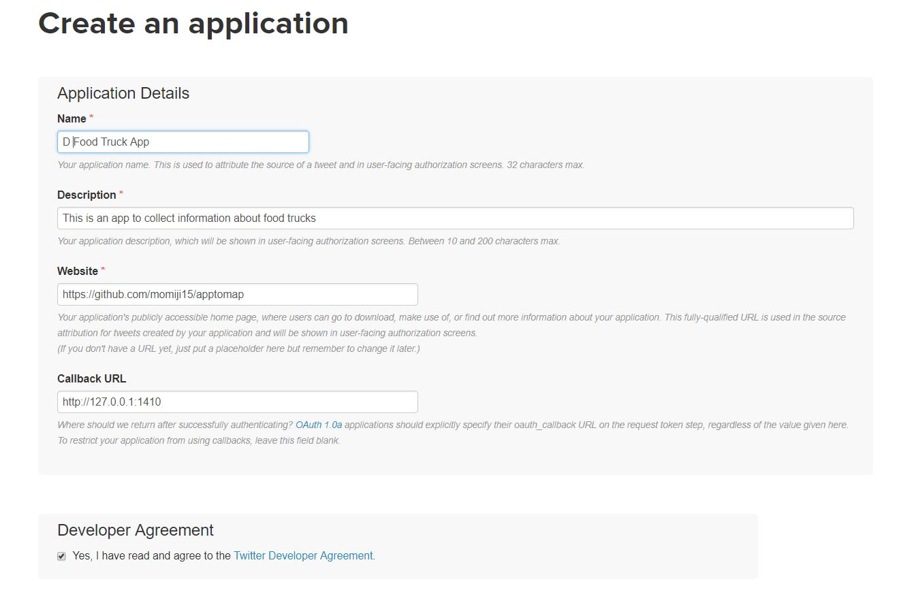
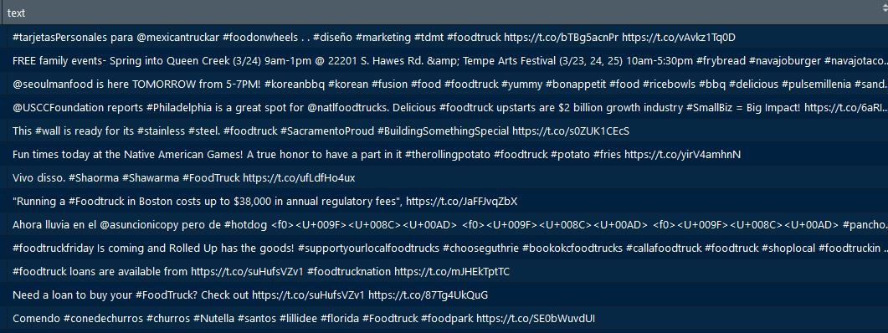

## Unit Learning Objectives
<b>1. To understand the Twitter API used for collecting data.</b>

<b>2. To learn how to do a one-time collection of tweets.</b>

<b>3. To learn how to do a continuous collection of tweets.</b>

<b>4. To generate a collection of tweets on a topic of your choice.</b>


## Lesson 1: Searching Twitter

### Scenario
<i>You decide that it might be a pretty good idea just to gauge how food truck related hashtags are being used in the Twitterverse. You feel that knowing this might allow you to get better insights on launching a successful social media campaign. You decide to check out a food truck that you have been following which is [Cupbop](https://www.sltrib.com/artsliving/food/2017/08/30/cupbop-serves-up-a-winning-combo-for-success-in-utah-and-beyond/)</i>.


### Instructions
1. Go to https://twitter.com/search-home

2. In the search box, type #cupboptruck and notice the results.

3. In the search box, type @cupboptruck and notice the results.

As you can see, the Twitter hashtag and the Twitter handle can produce entirely different results. By
using the Twitter search function, you can get a better idea of which search terms will do the
best job in collecting the information you want.


## Lesson 2: Getting to know the application program interface
Before you embark on this quest of collecting tweets, it is important to understand what you
need to use in order to collect the tweets. You know that you will be using R to write your code
order to collect the tweets, but what will your code be calling in order to collect those tweets?
The “thing” that you will need to call to get those tweets is called an <b>application program
interface (API)</b>. You can think of an application program interface as an electronic personal
assistant of sorts. You use the API in order to ask another program to do something for you. In
this case, we will be using the Twitter API in order to collect the tweets. Let’s get started! If you
do not have a Twitter account, then go to www.twitter.com and sign up for one. All you need to
provide is your full name, phone or e-mail and your password!

### Scenario 
<i>After doing some research, you realized that you will need to make a Twitter App in order to
collect the information that you need.</i>


### Terms to Know
<b>API</b>: Application Program Interface. A set of tools which allows you to build application software. For more information, click [here](https://medium.freecodecamp.org/what-is-an-api-in-english-please-b880a3214a82).

### Instructions
1. Go to apps.twitter.com and click on “Create New App.”

2. Fill out the application Name, Description and Website information.

If you do not have a website, then that’s okay! You can put your blog address, GitHub page, or something similar in the Website field.

3. In the "Callback URL" section, make sure to put http://127.0.0.1:1410. <b>This is important!</b>

4. Check “Yes, I agree” in the Twitter Developer Agreement and then click on the “Create
your Twitter application” button.

5. Once you do that, your app is created! If you ever want to change the name of the app, the description, or the website, you can click on the settings tab and change this information.

6. Click on the “Keys and Access Tokens” tab and take a look at the Consumer Key (API
Key) and Consumer Secret (API Secret). You will need the API Key and API secret in order to run the continuous Twitter collection. Make sure to keep these two items private.




<i>Note: If your app name is taken, try try again!</i>

##Lesson 3: Doing a one-time collection of tweets
It’s finally time to try a Twitter search and collection in R! Now that you have created a Twitter
App, you start to explore the [Twitter Developer page](https://developer.twitter.com/en/docs) to learn more about
how APIs work for Twitter. In order to test the waters, you want to do a one-time collection of
tweets.

The name of the R package that we will be using in order to access the Twitter API is the [rtweet](https://cran.r-project.org/web/packages/rtweet/rtweet.pdf) package created by Michael W. Kearney. The particular function that we will concern ourselves with in order to do a Twitter search the
search_tweets() function. Let’s get started!

### Scenario
You just got off the phone with one of your investors (aka your uncle) and he wants a
preliminary report about how people are tweeting about food trucks in the areas you're interested in having your food truck. You decide that you want to make a one-time collection of tweets using R.

###Terms to Know

<b>function</b>: A segment of a program that performs a certain task. 

<b>CSV</b>: Comma-separated values. A data format that stores number and text in plain text. Each record is separated by a comma.

<b>UTF-8</b>: Unicode Transformation Format 8-bit. A type of character encoding that supports unicode characters. For more information, click [here](https://www.w3schools.com/charsets/ref_html_utf8.asp).

### Instructions
1. Open up RStudio.
2. Click on File -> New File -> RScript or just click the icon on the top left corner and click on RScript. If you want to just follow along, feel free to do so and just run each code segement within the notebook! However, I recommend you write out the code so you can get the hang of it!
3. The first thing we are going to do is to install and load the rtweet package. In your code editor, type:
```{r, chunk-two, echo = TRUE, eval = FALSE}
install.packages("rtweet") #installs the package
library(rtweet) #loads rtweet
```

3. Now we are going to enter the API information of your app. Go to apps.twitter.com and
click on the app that you made.
4. Click on “Keys and Access Tokens.” You will need the name of your app, Consumer Key (API key),
and Consumer Secret(API secret). Put this information within the quotes.

```{r, chunk-three, echo=TRUE, eval= FALSE}
##whatever name you assigned to your created app
appname <- ""

##api key 
key <- ""

##api secret
secret <- ""

##create token named "twitter_token"
twitter_token <- create_token(
  app = appname, 
  consumer_key = key,
  consumer_secret = secret)
```

5.Once you do this, run your code! An external page will pop-up and there will be a message that says "Authentication complete. Please close this page and return to R."
6. Time to do a Twitter search! You want to get 1,000(n=1000) tweets about food trucks(#foodtruck), but you do not want to include retweets(include_rts = FALSE) Type:
```{r, chunk-four, echo=TRUE, eval=FALSE}
foodtrucktweets <- search_tweets("#foodtruck", n = 1000, include_rts = FALSE)
```
<i>This line of code is essentially saying, "Search for 1000 tweets that include the hashtag food trucks and do not include retweets. Put the tweets in a file named "foodtruck_tweets.json." F(f)oodtrucktweets is the name of the variable that you are assigning the function to.</i>

7. In the Data section of the RStudio IDE, you should see the new variable you made. Click on "foodtrucktweets" and you will see the tweets in a data frame. Here is an example of the tweets that I collected.


8. Like your uncle requested, you need to collect food truck related tweets in the areas you will have your food truck. You decide you want to check out what areas in Georgia are tweeting about food trucks.
```{r, chunk-five, echo=TRUE, eval=FALSE}
GAfoodtruck <-search_tweets("#foodtruck", n = 1000, include_rts = FALSE, geocode = lookup_coords("georgia"))

```
<i>This line of code is saying the same thing as above however this search is only happening within Georgia (geocode = lookup_coords("georgia")). You can do a search based on country, state, city, or city and state.</i>
9. So what if you wanted to save your data elsewhere? You can create a csv file which will store your tweets. Let's try collecting some more tweets but using a different search term!
```{r, chunk-six, echo = TRUE, eval = FALSE}
save_as_csv(foodtrucktweets, file_name = "foodtrucktweets.csv", prepend_ids = TRUE, na = "", 
            fileEncoding = "UTF-8")
```
<i>This line of code means that you are saving your foodtrucktweets variable as foodtruckstweets.csv, and you want to put an x next to all the Twitter IDs(prepend_ids=TRUE). For any missing data, you want to put an empty character in the cell (na = ""). Also, you want to encode the file to "UTF-8".</i>

<b>Congratulations! You did your first Twitter search using the rtweet package!</b>

## Lesson 3: Doing a continuous collection of tweets
When a one-time collection will not suffice, the other option is to collect tweets in real-time. The rtweet package can do this as well! You will need to use the stream_tweets() function in order to do this. One main difference between the search_tweets() function and the stream_tweets() function is that you can save your Twitter search in JSON. 

### Scenario
<i>You need to actually do some other work regarding your business (as in actually selling the
ramen and bubble tea), so it’s time to work smarter and not harder. You decide that while you're running errands to get what you need for the food truck, you will collect tweets in R for a particular time period (I recommend three hours, but for the sake of this tutorial, let’s do five minutes).</i>

### Terms to Know
<b>JSON</b>: JavaScript Object Notation. A  format which can store such data structures such as objects and arrays. To find out more information, check out the [official JSON page](https://www.json.org/) or this [page](https://www.w3schools.com/js/js_json_intro.asp).


<b>parsing</b>:To read JSON file in whatever programming language you are using(HTML, R, etc). 

### Instructions
1. If you already haven't done so, open up RStudio and create a new RScript. If you are continuing on from previous lessons, then go ahead and use the RScript you are using now!

2. Set your working directory if you haven't done so. You can do that two ways. Do you remember which ways you can set your working directory? If not, refer to the "Getting Started" notebook to refresh your memory.

3. If you haven't already, make sure to install and load the rtweet package. If you forgot how to do that, feel free to scroll up to the previous lesson!

4. Also, if you haven't already, make sure to add the app name, api key, api secret, and twitter token. I am just adding this code chunk for your convenience. 
```{r, chunk-eight, echo=TRUE, eval= FALSE}
##whatever name you assigned to your created app
appname <- ""

##api key 
key <- ""

##api secret
secret <- ""

##create token named "twitter_token"
twitter_token <- create_token(
  app = appname, 
  consumer_key = key,
  consumer_secret = secret)
```

5. Let's search for some tweets in real-time for five minutes! Let's create a variable called t which will store the time
limit to collect the tweets. This variable will be used in the timeout parameter of the stream_tweets() function. In rtweets the notation for the time out is as follows secs x minutes x hours x days. Here's some examples so this makes more sense:


`t <- 30` means to search for tweets for 30 seconds.

`t <- 60 * 3` means to search for tweets for three minutes.

`t <- 60 * 60 * 24` means to search for tweets for a period of one day.

`t <- 60 * 60 * 24 * 3` means to search for tweets for a period of three days.

Do you have any ideas how to create a time limit of five minutes? Let's find out if you are right!

6. The anticipation to see if you are right is over. If you were thinking that `t <- 60 * 5` was the right answer, then you are correct! You win the satisifaction that you know you got the answer right and increased confidence in searching for tweets in real-time! Let's go ahead and assign this value to t.
```{r, chunk-nine, echo = TRUE, eval = FALSE}
t<- 60 * 5
```

7. Let's go ahead and collect tweets for five minutes related to food trucks. Just for the sake of it, we are going to not parse the information and just save it to a JSON format.
```{r, chunk-ten, echo = TRUE, eval = FALSE}
foodtruckstream <- stream_tweets("food truck", timeout = t, file_name = "foodtrucktweets.json", parse = FALSE)
```
<i>This chunk of code is saying to collect tweets happening in real-time about food trucks for five minutes. Please save this file in json format and name it foodtrucktweets and do not parse it to be read in R</i>.

8. Go ahead and take a peek at your JSON file! Go into the file location of your project and your JSON file should be there. You can open up the JSON file with any text editor. 


9. Actually, after taking a look at the JSON file(which can be an eyesore if you haven't really dealt  with JSON files), it might be a good idea to parse your tweets so you can read it in R. There are two ways you can do this. You can just omit the file_name and parse parameters. The parse parameter defaults to TRUE. Or, you can just change your JSON file into a data frame.
```{r, chunk-eleven, echo = TRUE, eval= FALSE}
foodtruckparse <- parse_stream("foodtrucktweets.json")
```

10. In the data section of the RStudio IDE, click on "foodtruckparse" and you will see your information neatly arranged in a data frame!

## Lesson 4: It's Your Turn!

This lesson will be short and sweet. Choose a topic and search for some tweets about it! This lesson will also go over three useful things out of the whole pool of useful things in the rtweet package. If you want to see what else this package has to offer, go [here](http://rtweet.info/index.html) or refer to the [documentation](https://cran.r-project.org/web/packages/rtweet/rtweet.pdf).

### Useful Thing #1: Creating a plot to see the time frequency of tweets
This can be a useful function for it sees how tweets vary over time. Going back to our food truck example, let's see how people are tweets about food trucks within a four hour time period. We can do this by using the ts_plot function. We will plot the foodtrucktweets variable. In order to use this function, you need to install(if it's not already installed) and load ggplot2! 

### Terms to Know
<b>ggplot2</b>: An R package used for data visualization.
<b>vector</b>: A data type that stores data of the same type.

```{r, chunk-twelve, echo = TRUE, eval = FALSE}
ts_plot(foodtrucktweets, "4 hours") + ggplot2::theme_minimal()+
          ggplot2::theme(plot.title = ggplot2::element_text(face = "bold")) + 
          ggplot2::labs(x = NULL, y = NULL,
                        title = "Frequency of Tweets about Food Trucks",
                        subtitle = "Per four hour time period within the last five days",
                        caption = "Source: Twitter")
```
Going into ggplot2 is beyond the scope of this tutorial but you can check out this [online reference](http://ggplot2.tidyverse.org/reference/) to find out more information about ggplot2.

### Useful Thing #2: 
Interested in looking up users? There's a function for that! Going back to our food truck example, let's look up user data by the user name of some food trucks in Atlanta.

```{r, chunk-thirteen, echo = TRUE, eval = FALSE}
##Looking up food truck user accounts
foodtruckusers <- c("MactheCheeseatl", "BentoBusATL", "kingofpops", "texstacos", "notasfamous")

atlfoodtrucks <-lookup_users(foodtruckusers)

##extract most recent tweets from the food trucks
atlfoodtrucktweets <- tweets_data(atlfoodtrucks)

```
<i>FYI: The c() is a vector and each element is separated by a comma.</i>


### Useful Thing #3: 
You can see which users are following a certain twitter account. Let's see who is following the twitter handle for the Not As Famous Cookie food truck along with information about these accounts.
```{r, chunk-fourteen, echo = TRUE, eval = FALSE}
#get 200 users(n = 200) who are following the Not as Famous Cookie food truck(notasfamous)
notasfamous_twitterfollowers <- get_followers("notasfamous", n = 200)

#looking up the information of these users
notasfamous_followdata <- lookup_users(notasfamous_followers$user_id)
```


## You Made it!
Congratulations for reaching the end of this unit! Hopefully you have confidence in collecting tweets using the rtweet package! There's a whole lot more that this package offers so just don't stop at this tutorial! 
