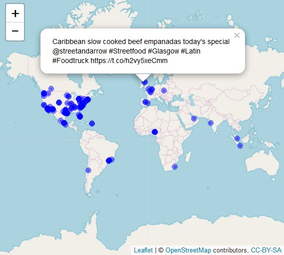
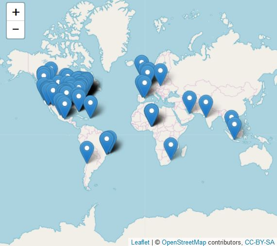
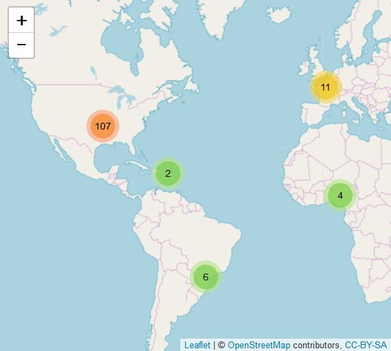
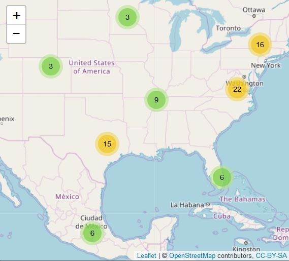
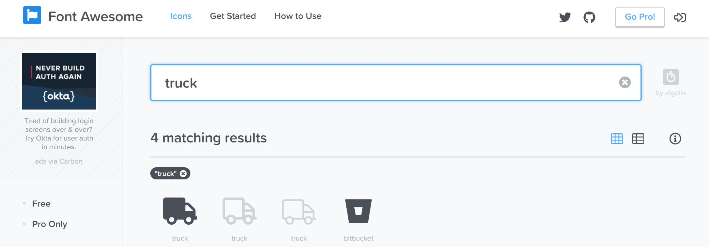
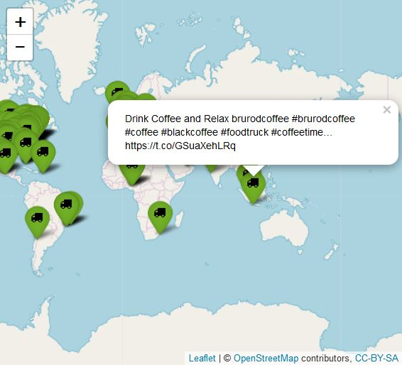

## Unit Learning Objectives
<b>1. To understand the basic functions of the leaflet for R package.</b>

<b>2. To map geotagged tweets.</b>

##Lesson 1: Introduction to Leaflet
Now that you have some data, you can now display it in a map. The particular R map package we will be using is Leaflet. Leaflet is a popular JavaScript based library in which you interactive maps. If you have used OpenStreetMap, you have seen the Leaflet interface before. For this tutorial, we will make only a basic map using Leaflet. For more information about Leaflet, go here:https://rstudio.github.io/leaflet/.

One thing worth mentioning is that Leaflet uses the magrittr pipe operator (%>%) which makes it easier to write code because the syntax is more natural. It might seem strange at first, but it does cut down on the amount of work you would have to do when writing code. You can find more information about the magrittr pipe operator here: https://github.com/smbache/magrittr.


### Scenario
<i>You finally have enough Twitter data to show some results to your investor. Your investor just called and asked for you to provide a map to see where people are tweeting about the competitors with your preliminary report. You want to make a Leaflet map since it’s interactive and provides a good visualization for your data.</i>

###Terms to Know
<b>leaflet</b>: A JavaScript package in which you can create interactive maps.

<b>magrittr</b>: An R package that uses operators that makes code more readable.

<b>%>%</b>: Magrittr pipe operator which is used assign values to expressions. The values that are on the 
            left-hand side of the pipe operator are assigned to the expressions on the right-hand side. 
            
## Lesson 2: Mapping Geotagged Tweets
            
Let's get mapping! Before you start mapping, let's find tweets that have geotagged information and create variables for latitude and longitude which can be used by the Leaflet package. Let's map the Twitter information about food trucks that was assigned to the foodtrucktweets variable in Unit 1 and assign it to a new variable named ft.

```{r, chunk-one, echo=TRUE, eval=FALSE}
ft <- lat_lng(foodtrucktweets)
```


After that, we need to download and load the leaflet library if you have not already done so.
```{r, chunk-two, echo = TRUE, eval = FALSE}
install.packages("leaflet")
library(leaflet)
```

Let's create a simple map of our tweets which will include the following elements:

1. Blue circles with a radius of 40, a weight(stroke width in pixels) of 8, and a fill opacity of .8.
2. Pop-ups that show the text of the tweets. 

```{r, chunk-three, echo = TRUE, eval = FALSE}
leaflet(ft) %>%
  addTiles() %>%
  addCircles(lng = ~lng, lat = ~lat, popup = ft$text, weight = 8, radius = 40, color = "blue", stroke = 
               TRUE, fillOpacity = 0.8)
```
As mentioned previously, the pipe operator are passing the expressions on the left-hand side of the operator to the expression on the right hand side. So essentially, we passed the ft variable to the addTiles function which creates the basemap. Then the values stored in addTiles were passed on to the addCircles function. Some things to note is the use of ~lng and ~lat. This allows the function to look for columns named "lat," and "latitude" for latitude and "long", "lng"", and "longitude"" for longitude. 'ft$text' refers to calling the text column of the ft variable. This is also known as subsetting the data.



### Using Markers and Clustering

If you are not into circles, you can use markers!
```{r, chunk-four, echo = TRUE, eval = FALSE}
leaflet(ft) %>%
  addTiles() %>%
  addMarkers(lng = ~lng, lat = ~lat, popup = ft$text)
```
The code is pretty much doing the same thing as the previous code with the exception that the values are passed to the addMarkers function. With the addMarkers function, you cannot change the color.



Sometimes you can have too much information on your map. In this case, it would make sense to cluster your markers so your map can have a cleaner appearance.

```{r, chunk-five, echo = TRUE, eval = FALSE}
leaflet(ft) %>% addTiles() %>% addMarkers(
  clusterOptions = markerClusterOptions()
)
```

#
#

The number of clusters displayed is affected by the zoom. You can also click on a cluster which will allow you to see smaller clusters.

Bummed out that you can't change the color of the markers and looking for some markers that are a little bit more awesome? Leaflet has a function called addAwesomeMarkers() in which you can access customized markers from the [Font Awesome](https://fontawesome.com/icons?d=gallery), [Bootstrap Glyphicons](https://getbootstrap.com/docs/3.3/components/), and [Ion Icons](http://ionicons.com/) libraries. 

Why don't we make a map that uses green markers with a truck icon on it? The library that we will be using to use the icon is the FontAwesome library. In R, we must call it by using the 'fa' arguement. If you want to use Glyphicons, the arguement is 'glyphicon,' and if you want to use Ion Icons, then the arguement is 'ion'. Another thing that we need is the name of the actual icon. We can find the name of that ico by going to the FontAwesome webpage and searching for a truck icon.



Now that we have the name of the library we want to use, along with the type of icon we want, let's make some awesome icons!

```{r, chunk-six, echo = TRUE, eval = FALSE}
icons <- awesomeIcons(
  icon = 'truck',
  iconColor = 'black',
  library = 'fa',
  markerColor = "green"
)
```

In these lines of code, we are assigning an icons variable to the awesomeIcons function in which we assign the truck icon to the type of icon we want to use. While we can be creative with the color of the truck, for the sake of being easy on the eyes, let's assign the color of the truck icons to be black. In addition, we called the Font Awesome library and made the marker color green.

Time to map our food truck tweets using the FontAwesome icons! 

```{r, chunk-seven, echo = TRUE, eval = FALSE }
leaflet(ft) %>%
  addTiles() %>%
  addAwesomeMarkers(lng = ~lng, lat = ~lat, icon = icons, popup = ft$text)
```



## Wrapping Up
In this  lesson, we displayed the Twitter information in an interactive map using Leaflet. This tutorial only touched the basics of using Leaflet. You can find more information on how to customize Leaflet maps at the official [Leaflet for R page](https://rstudio.github.io/leaflet/) along with the [documentation](https://cran.r-project.org/web/packages/leaflet/leaflet.pdf) for the Leaflet for R package. Go ahead and try to tweak your map even further!
