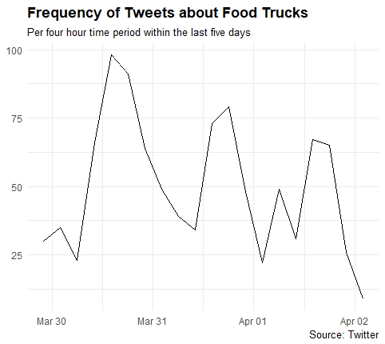
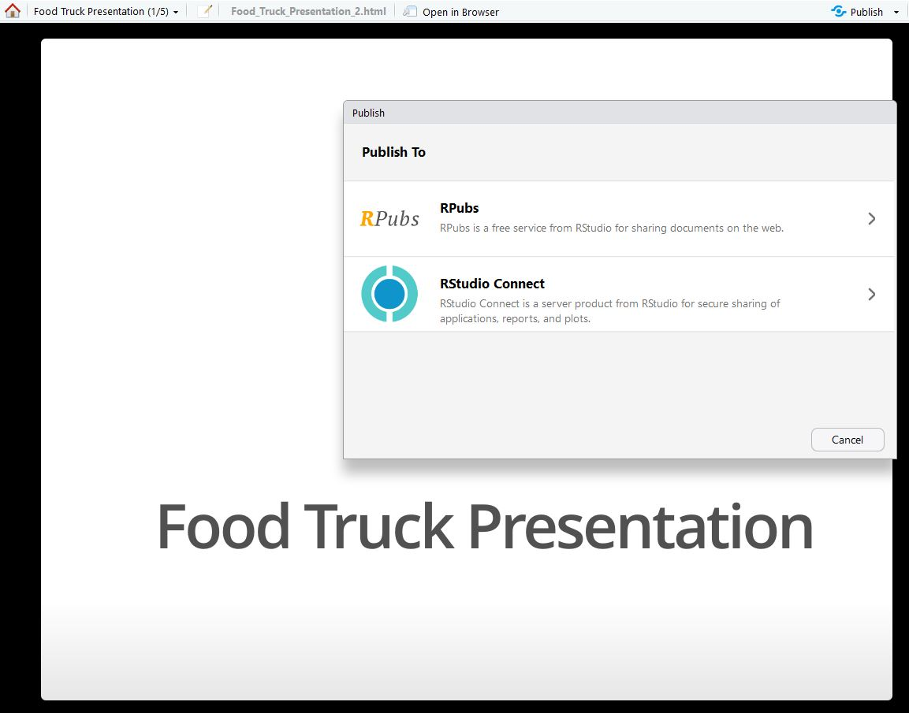
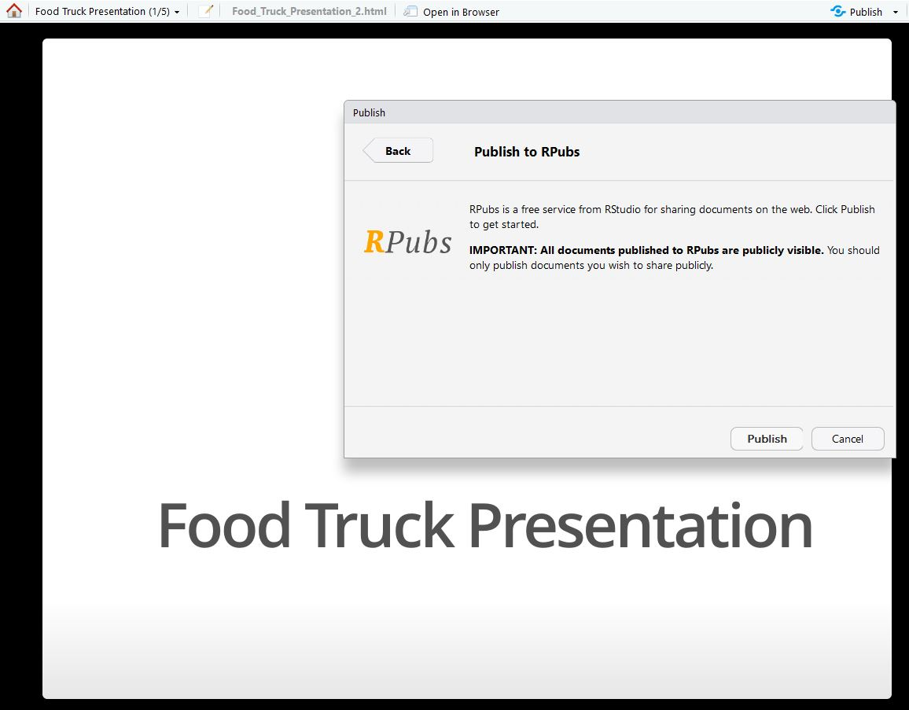

# R Ready to Map Unit 3: Using Interactive Documents

## Unit Learning Objectives
- To have a basic understanding RMarkdown framework
- To learn how to create a simple RMarkdown document.
- To learn how to create an R Markdown presentation.


## Lesson 1: Introduction to R Markdown
You've collected your tweets. You know how to map them. Now what? If you are interested with sharing your work beyond
just creating a map and sharing it, you can do so with creating R Markdown documents. R Markdown is a framework which you can make dynamic documents and make your research reproducible. R Markdown documents have three parts which are composed of the text that make up the documents, the code chunks that either static, automatic, or run based on a user prompt. Finally, there's the YAML metadata which gives you information about the document. The YAML is optional, so feel free to not add it if you don't need it. 

You have many options when it comes to creating R Markdown documents such as creating websites, slides, and dashboards. With R Markdown, you are able to run the code within the document and embed interactive elements such as a leaflet map! For more specific information about R Markdown go [here](https://rmarkdown.rstudio.com/). For this course, you will learn how to create a basic R Markdown document and R Presentation. 

To see what this notebook looks like as a published R Markdown document on RPubs, [click here](http://rpubs.com/momiji15/376038).


Make sure to install R Markdown along with the packages that is needed to R Markdown(known as dependencies) before making your R Markdown document.

```{r chunk-one, echo = TRUE, eval = FALSE}
install.packages("rmarkdown", dependencies = TRUE)
library(rmarkdown)
```

### Scenario
<i>You are satisfied with the data you have collected about food trucks and would like to share that information to both current and potential investors. You decide to do an open house at your house in which you will give a presentation along with creating a document that can be accessible online. You also want to make your presentation accessible online for those who will not be able to come to the open house. </i>

### Terms to Know

<b>rmarkdown</b>: An authoring framework which allows you to create a variety of documents such as presentations, webpages, and html documents.

<b>YAML</b>: Stands for "YAML Ain't Markup Language". YAML is a user-friendly and readable data serialization language 
for a variety of programming languages.

<b>data serialization</b>: Translating data structures in a format that can be stored and accessed later in its original format.  


## Lesson 2: Making an R Markdown Document
Let's make an R Markdown Document! Let's start out making a document which have some headers and italicized text. Before we do that, we need to open up an R Markdown document! Go to File -> New File -> R Markdown to open an R Markdown document. Fill in the information in the "title" and "author" fields and keep the default output format to HTML. I ended up naming  my document "Food Truck Report for Investors". Clear everything in the document with two exceptions:

  1. The code chunk which includes: `knitr::opts_chunk$set(echo = FALSE)`.
  2. The YAML data which is delinated by an `---`.


### Creating Headers 
Let's now make some headers. We will make a header for an introduction, map, preliminary analysis, and conclusion.
R Markdown has different types of headers. Here are some of the headers with the accompanying code for each header. 

# This is Header 1

`# This is Header 1`

## This is Header 2

`## This is Header 2`

### This is Header 3

`### This is Header 3`

...and so on. See a pattern? 

Add four Header 1 titles of the sections in your document and click the Knit button on the left-hand corner of your text editior interface to see what your headers look like. The Knit button renders a document from the R Markdown format to HTML. Make sure that you save your document! Save your document as foodtruckreport.rmd.


Let's add some filler text beneath the headers. All you have to do is simply type below the headers!
  1. Type "This is the introduction section." under the "Introduction" header.
  2. Type "This is the map section." under the "Map" section header.
  3. Type "This is the preliminary analysis section." Under the "Preliminary Analysis" header.
  4. Type "This is the conclusion section." Under the "Conclusion" header.
  
Click the Knit button and see the result. In the preview window, click on the "Open in Browser" button to see what it looks like in a web browser.

### Changing Text

Let's format some of the text. Let's *italicize* the sentence under the "Introduction."  You do this by adding an `*` before and after the sentence.

*This is the introduction Section.*
`*This is the introduction section.*`

Let's make the sentence under the "Map" section **bold.** You do this by adding an `**` before and after the sentence.
**This is the map section.**
`**This is the map section.**`

### Embedding a Leaflet Map Into Your Document
Remember in Unit 1 when we plotted the frequency of tweets about food trucks? We're going to add that plot to our document! We will do this by adding a code chunk. In order to add a code chunk you need to add this do your document:


```{r, chunk-two, echo = TRUE, eval = FALSE}```

  - "r" designates the language in which the code chunk will run in. R Notebooks are able to run code chunks in other 
     languages such as python.
  - "chunk-one" designates the name of the code chunk. You can name it anything.
  - "echo = TRUE" means that the actual code will display in your document.
  - "eval = FALSE" means that the code will not automatically run in the document. If you want to change this, change
     the value to TRUE.

Press Enter after the closing brackets to put the ``` on the following line. You will know where the code chunk is at because it will be highlighted.

Let's load our data that we exported to csv in Unit 1.  <b>Note:</b>If you did not geocode your data before exporting
your file to csv, do that now! To recap how to do that using the foodtrucktweets data:
```{r, chunk-three, echo = TRUE, eval = FALSE}

#add lat and long information to the foodtrucktweets variable
ft_latlong <- lat_lng(foodtrucktweets)

#Now you can save the file as a csv!
save_as_csv(ft_latlong, file_name = "foodtrucktweets.csv", prepend_ids = TRUE, na = "", 
            fileEncoding = "UTF-8")

```
The csv file that you will actually be using is one named "foodtrucktweets.tweets.csv". The rtweets package divides the csv file into a file for users("foodtrucktweets.users.csv") and one for the tweets. Make sure to do this in your code from Unit 1 and not within the R Markdown document you are creating.


Let's load the twitter data csv file into a data frame. This can be done by using the read.csv() function.  
```{r, chunk-four, echo = TRUE, cache=TRUE}
library(rtweet)
ft2 <- read.csv("foodtrucktweets.tweets.csv")
```
In my code block, I made cache = TRUE so the results of the code can be used in the next code chunks.


Let's map the leaflet data. You might get some warning messages, so within your code chunk, set `warning = FALSE`.
```{r, chunk-five, echo = TRUE, cache = TRUE, warning = FALSE}
library(leaflet)
leaflet(ft2) %>%
  addTiles() %>%
  addCircles(lng = ~lng, lat = ~lat, popup = ft2$text, weight = 8, radius = 40, color = "blue", stroke = 
               TRUE, fillOpacity = 0.8)

```


### Adding Links To Your Presentation
Let's add an image of your plot to your presentation by adding a link to your image from your working directory. If you have not set your working directory, then you can do so by going to Session -> Set Working Directory -> To Source File Location. I made an image folder for all of my images, so I will be linking to that. You can do this by writing this in your document(you do not need to put this in a code chunk!)

``



What if you want to add text to your document with a hyperlink to another website? Here's how you do it! You put the name of the text in the brackets and the website within the parentheses. 
`[Not As Famous Cookie Company Food Truck](https://www.notasfamous.com/)`

[Not As Famous Cookie Company Food Truck](https://www.notasfamous.com/)

###Publishing Your Document
It's quite easy to publish your document. We will be publishing our documents on the [RPubs](http://www.rpubs.com/)
website. Go to the website and create an account. Once you have done that, you can publish your document. Go ahead and Knit your document. Once you have done so, click on "Publish" in the Preview browser.

You will get a prompt to whether you want to publish on RStudio Connect or RPubs. You want to choose RPubs.


After that click on Publish. 


You will be directed to an external Rpubs page. Enter in the name of the document along with a description. You can give your site a semi-customized URL if you want.


## Lesson 3: Creating an R Presentation

Time to create an R presentation! You can do this by going to File -> New File -> R Markdown. Make sure to click "Presentation" on the left panel and name your presentation "Food Truck Presentation" in the title section. Leave the Default Output format to ioslides. You will now see a new document pop up in the RStudio IDE.


You can use the same syntax to create an R Presentation as it is to create an R Markdown document but there are a few differences. The template provided gives you a good idea on the barebone basics of creating an R Presentation. Each slide is divided by a `##` and the title of the slide is after the `##`.

`## Slide Title`

Let's make a presentation template! Take a look at the default template to better understand the syntax of creating an R Markdown presenation. Clear everything in the document with two exceptions:

  1. The code chunk which includes: `knitr::opts_chunk$set(echo = FALSE)`.
  2. The YAML data which is delinated by an `---`.
`


Add a title of each section of your report to your R Presentation(Introduction,
Map, Preliminary Findings, Conclusion).  Make sure to add a sentence describing each slide.After that, add the leaflet map to the Map slide and the link to the plot to the Preliminary Findings slide. You can merely copy and paste from the previous lesson to save time!


##Publishing your presentation
The process of publishing your presentation is the same as publishing the R Markdown document. Click on the Knit button
and you will see your presentation pop up in an external window. Take a look at it to see if there are any issues. You can scroll back and forth by pressing the left and right arrow key. If everything looks okay, then you're all set to go!

Click on the Publish button on the top-right hand corner of the window and click on RPubs when prompted where to publish. 




You will be directed to an external Rpubs page. Enter the name of the document along with a description. You can give your site a semi-customized URL if you want.


